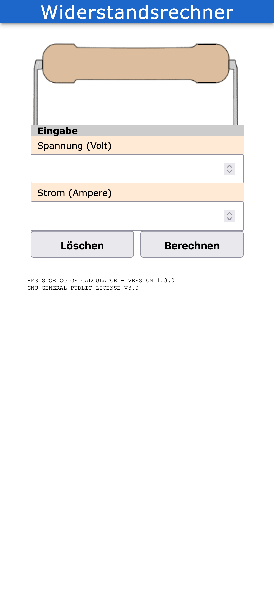
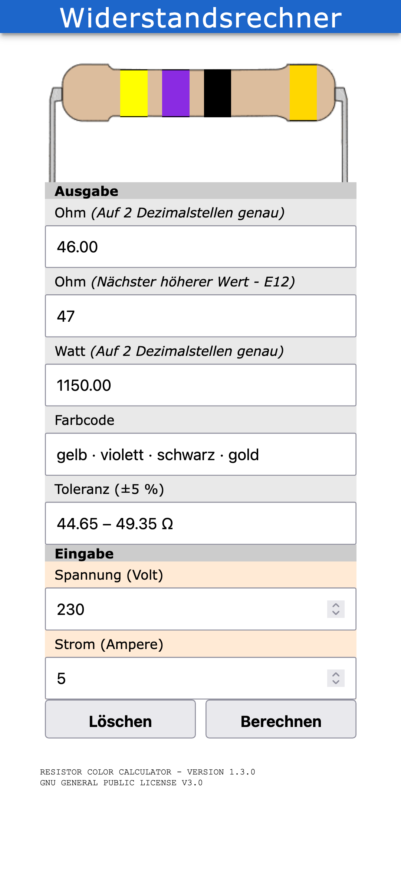

# Resistor Color Calculator — PWA

A lightweight, installable **Progressive Web App** that calculates the resistance value **R** from a given current **I** and voltage **U**, and displays the matching **4-band color code**. Range: 10 – 10000 Ω (E12 series).

**Live demo:** https://mecodeup.github.io/resistor-color-calculator/

## Screenshots

| Input view | After pressing “Berechnen” |
|:----------:|:--------------------------:|
|  |  |

On load only the inputs and a blank resistor are shown; pressing **Berechnen** reveals the results and colors the bands.

## Features

- **Ohm's law calculation** — enter voltage (V) and current (A), get:
  - Resistance **R** (`U / I`), rounded to 2 decimals
  - Nearest higher **E12** value
  - Power **P** (`U · I`) in watts
- **4-band color code** rendered visually for the E12 value
- **Readable color code** — the bands are also shown as localized text
  (e.g. `brown · red · brown · gold`) in a copyable field
- **Tolerance range** — the ±5 % range for the E12 value (e.g. `114 – 126 Ω`)
- **Accessible** — each band exposes its color name as `aria-label` + tooltip
  for screen readers and color-blind users
- **Input validation** — empty, non-numeric or non-positive values are rejected
  with a clear, localized message
- **Installable PWA** — add to home screen, runs standalone, with a maskable
  Android icon and a 180×180 iOS touch icon
- **Offline support** — full app shell and assets are cached by the service worker
- **Multilingual** — German, English, French, Italian, Spanish, Portuguese (via [webL10n](https://github.com/fabi1cazenave/webL10n))
- **No build step, no dependencies** — plain HTML, CSS and vanilla JavaScript

## How it works

The color code is derived from the E12 resistance value:

| Band | Meaning |
|------|---------|
| 1 | First digit |
| 2 | Second digit |
| 3 | Multiplier (×10ⁿ) |
| 4 | Tolerance (gold = ±5 %) |

Digit → color mapping: black `0`, brown `1`, red `2`, orange `3`, yellow `4`, green `5`, blue `6`, violet `7`, grey `8`, white `9`.

*Example:* 12 V / 0.1 A → 120 Ω → **brown · red · brown · gold**.

## Run locally

The service worker registers with a relative path, so you can serve the repo folder directly:

```bash
# from inside the repo folder
python3 -m http.server 8000
```

Then open http://localhost:8000/.

## Project structure

```
index.html          App shell
css/style.css        Styles
js/app.js            Service worker registration
js/script.js         Calculation + color-code rendering
js/functions.js      Ohm/Watt math + form validation
js/l10n.js           webL10n localization library
locales/             Translations (de, en, fr, it, es, pt)
sw.js                Service worker (offline cache)
manifest.json        PWA manifest — also the single source of the app version
```

The app version lives only in `manifest.json` (`"version"`); the footer reads it
from there at runtime. To release, bump that field and the service worker
`CACHE_NAME` in `sw.js`.

## License

GNU General Public License v3.0 — see [LICENSE](LICENSE).

Author: Christina Andersen · Publisher: Andersen Art Visual
